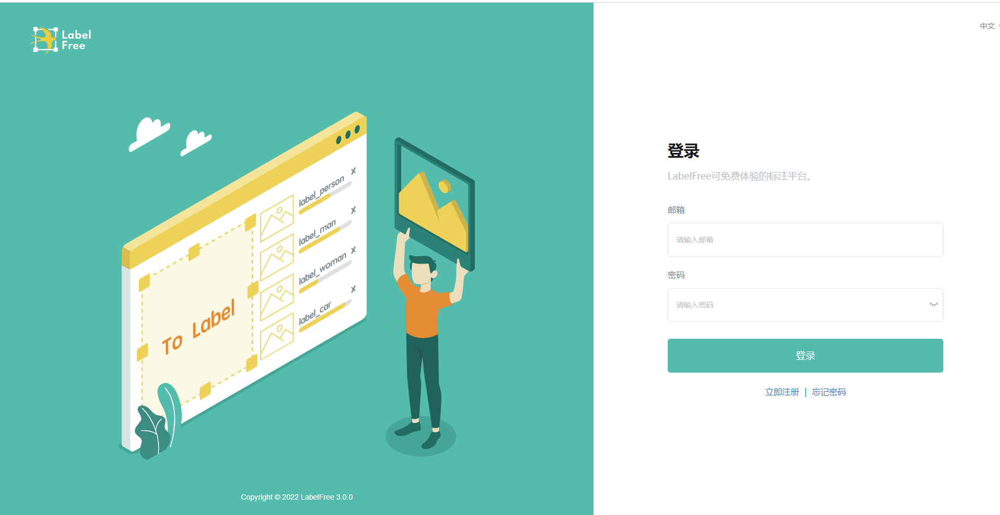

<!-- ---
hide:
  - navigation
--- -->
!!! tip inline end
    最新支持Segment Anything,目前仅支持docker-compose部署方式，其他方式将在后续版本支持。
LabelFree 以下部署方式：


- windows exe安装包
- Docker
- Docker Compose

!!! info "部署方式"
    === "windows exe安装包"
        
        ### 1 下载安装包
        下载地址： 

         - [国际下载](https://github.com/IndustryEssentials/label-free/releases/download/4.1.0/labelfree_app.zip) 


         - [国内备用下载](https://www.123pan.com/s/cUhcVv-3GOF3.html){target=_blank}（国内用户使用）
        
        
        ### 2 安装
        双击安装包，解压后双击`LabelFree.exe`启动。


    === "docker"

        ### 请执行以下命令
        ```bash title="docekr 模式"
        docker run -p 8080:80  -v `pwd`/lbf/db:/var/lib/mysql -v `pwd`/lbf/cache:/redis_data -v `pwd`/lbf/minio:/minio_data -d labelfree/lite:latest
        ```
        
    === "docker-compose"


        ### 1 clone 本仓库
        请执行以下命令：
        ```bash
        git clone https://github.com/IndustryEssentials/label-free.git

        cd label-free
        ```

        ### 2 启动
        ```bash title="docekr compose 模式"
        docker-compose up -d
        ```
        !!! note
            最新版本docker-compose命令已经改为docker compose，如果您使用的是最新版本，请使用:
            
            docker compose up -d


### 3 访问

```bash
http://YOUR_HOST_IP:8080
```

默认管理员账号、密码：
!!! info inline end

    如发现无法新建项目，请确认使用的是默认管理员账号登陆。
    新注册账号默认为标注员，无新建项目权限。

```
labelfree@viesc.com
labelfree@2022
```

一切完成，开始标注工作吧！🍻🍻🍻

