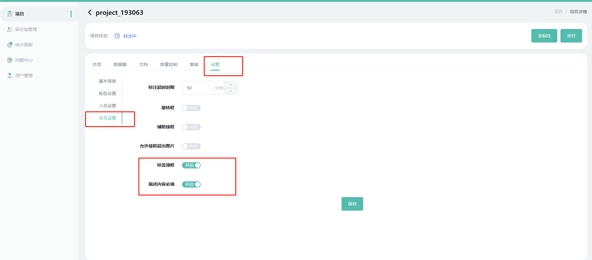
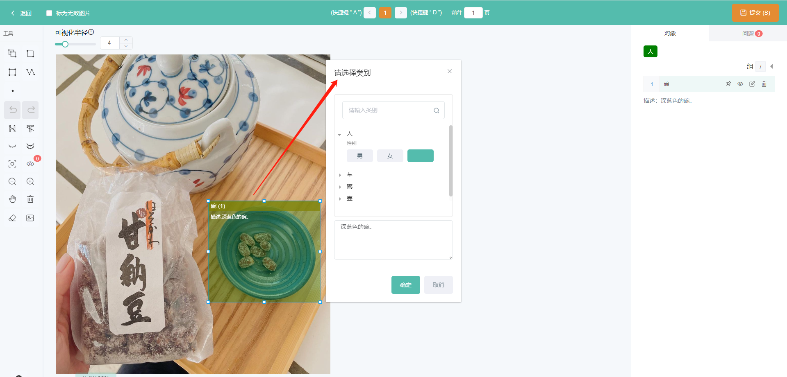
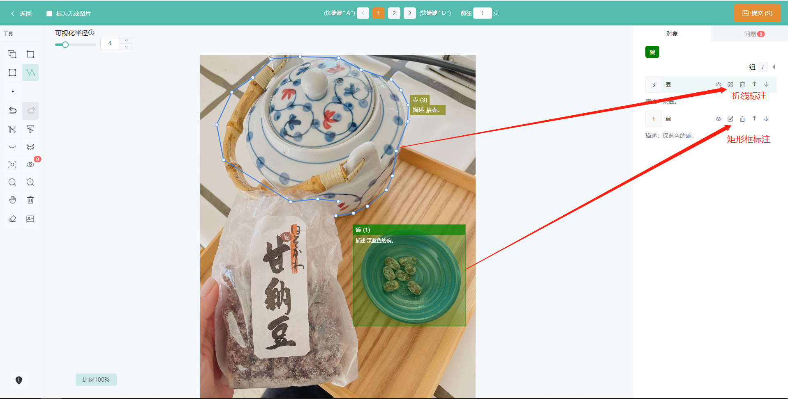

### 打开多模态标注

在**项目详情-设置-交互设置**界面，打开**标签弹框**的开关并保存，即切换到多模态标注模式，关闭该开关，可回到原标注模式。

若需要将多模态标注时的描述设置必填项，打开**描述内容必填**并保存开关即可。

### 多模态标注

切换到多模态标注模式后，点击标注按钮，进入标注界面，使用标注工具标注一个对象（点线框都可以），程序会自动弹出多模态标注弹框，填写多模态参数，点击确认即可。

注意：点线标注与多模态标注数据仅支持coco数据集导出。

### 多模态标注对象编辑

需编辑多模态参数，点、线标注与矩形框稍有不同。

- 矩形框标注：矩形框标注可使用左键选中标注框，再点击右键，呼出编辑弹框，编辑弹窗与新增标注的弹窗一致；
- 点、线标注：点线标注仅支持在对象列表点击**编辑**图标，呼出编辑弹窗（矩形框标注也支持该操作）；

