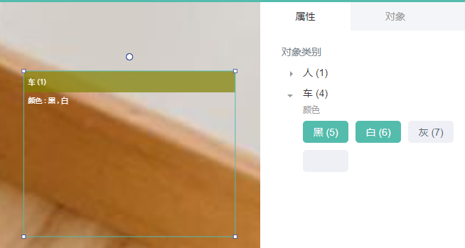

labelfree原生支持多级标签，并支持多级标签的导入导出。系统默认的标签为：人、车多级标签

## 标签样例


## 标注界面


其中1、2、3、4为标签选择快捷键

### 标签数据导出

具体的格式信息为：

```Bash
tag1;sub_tag2:sub_tag3,sub_tag
```

在labelfree中，一级标签是一个标签的主体单位，以下是一个多级标签的例子



VOC导出的xml标注中的标签信息为：

```Bash
  <object>                                          # 一个目标对象的信息
    <name>车;颜色:黑,白</name>                          # 目标的类别名
    <pose>Frontal</pose>                            # 拍摄角度，Unspecified
    <truncated>0</truncated>                        # 是否被截断，0表示完整未截断
    <difficult>0</difficult>                        # 是否难以识别，0表示不难识别
    <bndbox>                                        # 边界框信息
      <xmin>104</xmin>                              # 左上角x
      <ymin>78</ymin>                               # 左上角y
      <xmax>375</xmax>                              # 右下角x
      <ymax>183</ymax>                              # 右下角y
      <rotate_angle>2.889813</rotate_angle>         # 旋转角度,默认为0，顺时针为正
    </bndbox>
  </object>
```

