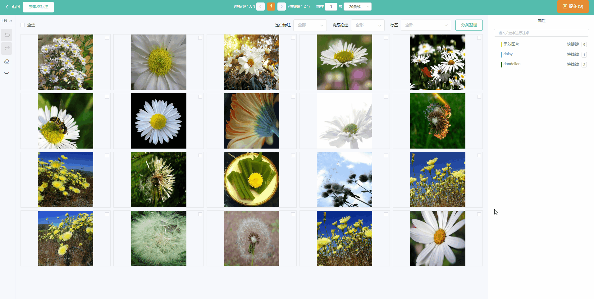

<!-- ---
hide:
  - toc
--- -->

<figure markdown>
  { width="450" }
  <!-- <figcaption>LabelFree 标注系统</figcaption> -->
</figure>

## 特性

- **简单**。简化操作，快速上手。
- **高性能**。支持**超大数据集标注**、流畅**多人在线标注**体验。
- **智能**。内置算法模型，支持**交互式辅助分割标注**，提高10×标注效率🚀🚀🚀。
- **通用**。支持VOC、COCO等主流数据集格式导出。
- **开放**。支持**免费私有化部署**，数据安全可靠。
- **一键标注**。提供专业、一站式的数据标注服务。

<table>
    <tr>
        <td></td>
        <td></td>
        <td></td>
    <tr>
    <tr>
        <td align="center">目标检测</td>
        <td align="center">图像分割</td>
        <td align="center">图像分类</td>
    <tr>
</table>

## 4.1.0更新内容

此版本主要面向标注人员，提供了一些新功能、性能提升和改进。

### 新功能：

1.  目标检测：
  
    - 支持检测框自动贴边
    - 超出边界
    - 辅助框模式
  
2.  图像分类：
  
    - 支持拖拽模式选择图片
    - 支持shift多选
  
3.  数据集：
  
    * 支持在数据集模块中进行质检
    * 支持释放数据给其他标注员进行标注
    * 支持[IF_DATA](./chapters/if_data.md)格式解析、导出
  
4.  项目管理：

    - 支持指定人员进行标注

    - 支持交互设置

### 优化

1.  图像分割

    -  引入高性能图形渲染组件，解决大量掩膜渲染问题

  
2.  数据集
  
    -  全面优化数据集解析速度

3.  部署
  
    -  支持windows环境下[exe部署](./chapters/deploy.md)
    -  支持单容器docekr部署

